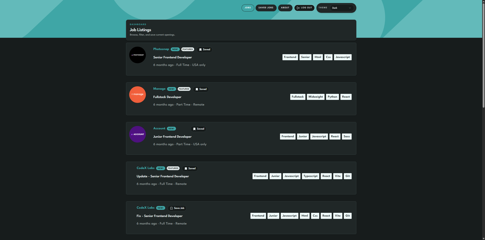
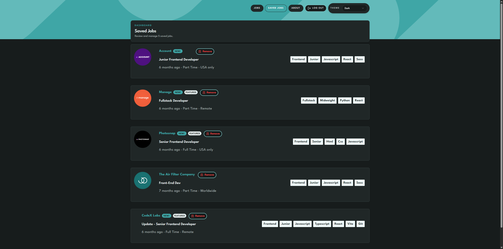

# Job Listings App

A full-stack job listings application built with React, Node.js, Express, Prisma, and PostgreSQL.

Originally developed as my CodeX Academy Level 4 capstone and later expanded as a portfolio project, the application grew from a Frontend Mentor challenge into a multi-page full-stack application with authentication, protected routes, persistent data, saved jobs, filtering, and responsive theming.

The project demonstrates a complete frontend → API → database flow with an emphasis on maintainable architecture, clear data flow, and practical full-stack integration.

---

## Live Application

**Live Site:** https://femjoblistings.netlify.app/

The React frontend is deployed on Netlify and communicates with a Node.js/Express API hosted on Render. Application data is stored in PostgreSQL hosted through Supabase and accessed through Prisma.

> **Note:** The backend uses Render's free tier and may take a short time to wake after a period of inactivity.

---

## Demo Account

You can create your own account or use the demo account below to explore the authenticated experience.

**Email:** `user3@example.com`

**Password:** `Password1!Password1!`

The demo account includes saved jobs so you can test filtering, saving, removing jobs, and authenticated dashboard behavior.

---

## Key Features

- Browse and filter job listings
- View individual job details through routed pages
- Register and log in with JWT-based authentication
- Access protected authenticated routes
- Save and remove bookmarked jobs
- Persist user and bookmark data through the backend API
- Switch between light, dark, high-contrast, and system themes
- Responsive layout for desktop and mobile screens
- Custom 404 handling with SPA routing support

---

## Screenshots

### Job Listings



### Saved Jobs



---

## Tech Stack

**Frontend**

- React
- Vite
- JavaScript (ES6+)
- React Router
- Tailwind CSS
- shadcn/ui
- Axios

**Backend & Data**

- Node.js
- Express
- Prisma ORM
- PostgreSQL
- Supabase database hosting
- JSON Web Tokens (JWT)
- bcryptjs

**Testing & Development**

- Vitest
- Testing Library
- Cypress
- Postman
- ESLint
- Stylelint
- HTMLHint
- Prettier

**Deployment**

- Netlify — frontend
- Render — backend API
- Supabase — PostgreSQL database
- AWS S3 and CloudFront — previous frontend deployment completed during CodeX Academy cloud deployment practice

---

## Technical Approach

The frontend communicates with the backend through a centralized API client, keeping network requests separate from presentation components.

Application data flows through:

```text
React → API client → Express routes → controllers → repositories → Prisma → PostgreSQL
```

The backend uses a layered structure that separates HTTP handling, business logic, and database access.

Authentication is handled with JWTs. Protected frontend routes require an authenticated user, while protected backend endpoints validate Bearer tokens through middleware.

Job and bookmark data are persisted in PostgreSQL. Bookmark relationships are scoped to individual users and enforced through the database layer.

The frontend also includes an SPA fallback on Netlify so direct navigation to React Router routes continues to work correctly.

---

## Project Development

This project evolved from a frontend job-listing challenge into a connected full-stack application.

Development included:

- Expanding a single-page frontend into a routed React application
- Building a Node.js/Express REST API
- Adding PostgreSQL persistence through Prisma
- Implementing registration, login, logout, and protected routes
- Adding user-specific saved-job functionality
- Connecting the deployed Netlify frontend to the Render API
- Configuring CORS between frontend and backend environments
- Adding loading, authentication, error, and empty-data states
- Building reusable hooks and shared frontend state
- Adding responsive themes using shared CSS variables and tokens
- Testing backend endpoints with Postman
- Adding SPA routing support for direct Netlify navigation

---

## What I Learned

This project strengthened my understanding of:

- Connecting a React frontend to a separately deployed REST API
- Designing and consuming authenticated API endpoints
- Structuring backend applications with routes, controllers, repositories, and middleware
- Modeling relational data with Prisma and PostgreSQL
- Managing JWT-based authentication across frontend and backend
- Handling environment variables and CORS across deployed services
- Building reusable hooks and shared state for API-driven interfaces
- Debugging issues across frontend, backend, database, and deployment layers
- Refactoring an application as its architecture grows

---

## Running the Frontend Locally

Clone the repository:

```bash
git clone https://github.com/ellamkoch/fem-joblistings-app.git
cd fem-joblistings-app
```

Install dependencies:

```bash
npm install
```

Create a `.env` file:

```env
VITE_API_BASE_URL=http://localhost:3005
```

Start the development server:

```bash
npm run dev
```

The frontend will typically be available at:

```text
http://localhost:5173
```

The backend should also be running locally, or `VITE_API_BASE_URL` can point to the deployed Render API.

---

## Backend Repository

The backend API is maintained separately:

https://github.com/ellamkoch/be-joblistings-app

The backend repository contains the Express API, Prisma schema, database access layer, authentication middleware, API documentation, seed data, and Postman testing resources.

---

## Known Limitations

- Render free-tier services may require a short startup period after inactivity
- Supabase free-tier projects may pause after extended inactivity
- Some frontend tests need updates following the API refactor
- Light and high-contrast themes need additional token and contrast refinement
- Seed data is intentionally limited

---

## Future Improvements

Potential future enhancements include:

- Expand automated frontend and backend test coverage
- Improve accessibility and contrast validation
- Refine light and high-contrast theme tokens
- Move job-detail fetching into a dedicated hook
- Expand seed data for additional UI states
- Continue refining responsive behavior

---

## Acknowledgements

The original interface concept was inspired by the [Frontend Mentor Job Listings challenge](https://www.frontendmentor.io/).
